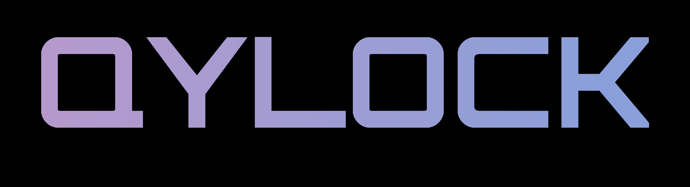

<p align="center">
  
</p>

<br>

<p align="center">
  <a href="#-sddm-setup">SDDM</a> &nbsp;&nbsp;·&nbsp;&nbsp;
  <a href="#-quickshell-setup">Quickshell</a> &nbsp;&nbsp;·&nbsp;&nbsp;
  <a href="#-gallery">Gallery</a> &nbsp;&nbsp;·&nbsp;&nbsp;
  <a href="#-credits">Credits</a>
</p>

<p align="center">
  <a href="https://github.com/sddm/sddm"></a> <a href="https://github.com/outfoxxed/quickshell"></a> <a href="https://github.com/Darkkal44/qylock/stargazers"></a> <a href="https://ko-fi.com/darkkal"></a>
</p>

<br>

<p align="center">
  A curated collection of cozy lockscreen themes for SDDM and Quickshell.<br>
  Switch themes instantly with the script!!
</p>

<br>

---

<br>

## ⚡ SDDM Setup

### Dependencies

| | Packages |
|:--|:--|
| **Core** | `sddm` &nbsp; `qt5-graphicaleffects` &nbsp; `qt5-quickcontrols2` &nbsp; `qt5-svg` |
| **Video · Qt5** | `qt5-multimedia` |
| **Video · Qt6** | `qt6-multimedia-ffmpeg` |
| **Optional** | `fzf` |

### Install

```sh
chmod +x sddm.sh && ./sddm.sh
```

> [!NOTE]
> The script uses `fzf` for an interactive theme picker. Falls back to a numbered list if not installed.

<br>

### Font Requirements

Some themes rely on fonts that cannot be bundled here (copyright issues). Download the font and drop it into `themes/<theme_name>/font/` — it loads automatically.

| Theme | Font | Filename |
|:--|:--|:--|
| NieR: Automata | FOT-Rodin Pro DB | `FOT-Rodin Pro DB.otf` |
| Terraria | Andy Bold | `Andy Bold.ttf` |
| Genshin Impact | HYWenHei-85W | `zhcn.ttf` |
| Sword | The Last Shuriken | `The Last Shuriken.ttf` |
| Minecraft | Minecraft Regular | `minecraft.ttf` |

<br>

---

<br>

## 🔒 Quickshell Setup

### Dependencies

| | Packages |
|:--|:--|
| **Core** | `quickshell` &nbsp; `qt6-declarative` &nbsp; `qt6-5compat` |
| **Video** | `qt6-multimedia` &nbsp; `qt6-multimedia-ffmpeg` |
| **Optional** | `fzf` |

### Install

```sh
chmod +x quickshell.sh && ./quickshell.sh
```

### Bind a Shortcut

Point your WM keybind to:

```sh
~/.local/share/quickshell-lockscreen/lock.sh
```

Compatible with **Hyprland**, **Qtile**, **Sway**, **i3**, and more.

<br>

---

<br>

## 🎨 Gallery

<br>

<table>
  <tr>
    <td align="center" width="50%">
      <b>Pixel · Coffee</b><br><br>
      
    </td>
    <td align="center" width="50%">
      <b>Pixel · Dusk City</b><br><br>
      
    </td>
  </tr>
  <tr>
    <td align="center" width="50%">
      <b>Pixel · Emerald</b><br><br>
      
    </td>
    <td align="center" width="50%">
      <b>Pixel · Hollow Knight</b><br><br>
      
    </td>
  </tr>
  <tr>
    <td align="center" width="50%">
      <b>Pixel · Munchax</b><br><br>
      
    </td>
    <td align="center" width="50%">
      <b>Pixel · Night City</b><br><br>
      
    </td>
  </tr>
  <tr>
    <td align="center" width="50%">
      <b>Pixel · Rainy Room</b><br><br>
      
    </td>
    <td align="center" width="50%">
      <b>Pixel · Skyscrapers</b><br><br>
      
    </td>
  </tr>
  <tr>
    <td align="center" width="50%">
      <b>NieR: Automata</b><br><br>
      
    </td>
    <td align="center" width="50%">
      <b>Terraria</b><br><br>
      
    </td>
  </tr>
  <tr>
    <td align="center" width="50%">
      <b>Enfield</b><br><br>
      
    </td>
    <td align="center" width="50%">
      <b>Sword</b><br><br>
      
    </td>
  </tr>
  <tr>
    <td align="center" width="50%">
      <b>Paper</b><br><br>
      
    </td>
    <td align="center" width="50%">
      <b>Windows 7</b><br><br>
      
    </td>
  </tr>
  <tr>
    <td align="center" width="50%">
      <b>Cyberpunk</b><br><br>
      
    </td>
    <td align="center" width="50%">
      <b>TUI</b><br><br>
      
    </td>
  </tr>
  <tr>
    <td align="center" width="50%">
      <b>Porsche</b><br><br>
      
    </td>
    <td align="center" width="50%">
      <b>Genshin Impact</b><br><br>
      
    </td>
  </tr>
  <tr>
    <td align="center" colspan="2">
      <b>Ninja Gaiden</b><br><br>
      
    </td>
  </tr>
</table>

<br>

---

<br>

## 🤝 Credits

| | |
|:--|:--|
| ☕ **[max](https://ko-fi.com/B0B1UPVVB)** | Genuinely blown away — thank you! |
| **Pumphium** | Theme suggestions, testing, and late-night debugging. |
| **Qt / QML Community** | The framework powering every theme in this collection. |
| **Unixporn** | Endless aesthetic inspiration and community feedback. |

<br>

---

<br>

<p align="center">
  <i>Make your login your own.</i>
  &nbsp;&nbsp;·&nbsp;&nbsp;
  <a href="https://ko-fi.com/darkkal">☕ Buy me a coffee</a>
</p>

<br>
